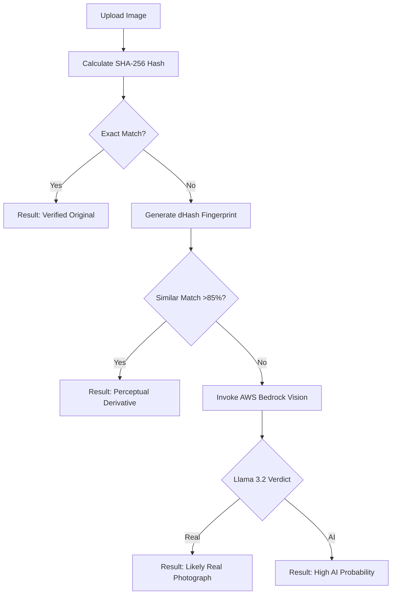

# ExposAI: Quantum-Safe Provenance Hub

Generative AI has made it effortless to create hyper-realistic fakes. It is at a point where even humans and AI themselves find it hard to distinguish between AI generated content and real content. Deepfakes spread misinformation, artists lose ownership of their work, and the public can no longer trust what they see. 

ExposAI is a high-performance image verification system designed to restore trust in digital media. By leveraging the **Abelian (QDay) Blockchain** and **AWS Bedrock AI Vision**, ExposAI allows creators to anchor AI-generated content to an immutable ledger and provides consumers with a sophisticated forensic verification layer to detect synthetic media. We imagine a future where every AI model uses our product to automatically stamp a 'made by AI' certificate the moment it is produced.

Our target customers include:
- Journalists & Media – Verify sources before publishing.
- General Public – Check images they encounter daily.
- Social Platforms – Integrate trust scores and flag fakes.
- Content Creators – Prove ownership and protect their work.

#Team Members & Roles
Developers: Anant/Oak
Ideation & Video Production: Achi/Anna/Klarc

---

LINK: https://delay-no-more-six.vercel.app

## 🏛 Technical Architecture

The system is built on a modern **Next.js 15** (App Router) foundation, utilizing a "Sponsored Minting" architecture where the platform manages gas costs and signing server-side to provide a seamless, wallet-less experience for end-users.

### Core Technology Stack
- **Frontend**: Next.js 15, TypeScript, React 19, Vanilla CSS (Glassmorphism).
- **Blockchain**: QDay Testnet (Abelian Layer 2), `ethers.js` v6.
- **Smart Contracts**: Solidity 0.8.19 (EVM Paris-compatible), OpenZeppelin v4.9.0.
- **AI Engine**: AWS Bedrock (Llama 3.2 90B Vision), multimodal analysis via Converse API.

---

## 📂 Project Structure

```text
.
├── app/                        # Next.js App Router (Pages & API)
│   ├── api/                    # Serverless API Endpoints
│   │   ├── mint/               # POST: Sponsored QDay Minting Logic
│   │   └── verify/             # POST: Unified AI + Blockchain Verification
│   ├── mint/                   # Client: AI Media Branding Interface
│   ├── verify/                 # Client: Forensic Trace & Verify Interface
│   ├── registry/               # Client: Public Provenance Dashboard
│   ├── layout.tsx              # Root Layout & Metadata (Branding)
│   ├── page.tsx                # Hero Landing Page
│   └── globals.css             # Global Design System (Tokens & Styles)
├── components/                 # Reusable UI Components
│   ├── Header.tsx              # Navigation & Branding
│   ├── Footer.tsx              # Links (Abelian/AWS) & Copyright
│   ├── UploadZone.tsx          # Specialized Drag-and-Drop Image Handler
│   └── VerificationResult.tsx  # Dynamic Result Display (AI + On-Chain)
├── contracts/                  # Smart Contract Layer
│   ├── AbelianAIAuthenticator.sol # ERC-721 Provenance Registry
│   └── DEPLOYMENT_GUIDE.md     # QDay-specific Remix Deployment Manual
├── services/                   # Integration Layer (Logic)
│   ├── bedrockAI.ts            # AWS Bedrock Converse API Implementation
│   ├── abelianBlockchain.ts    # QDay Network & RPC Logic (ethers.js)
│   └── aiModel.ts              # Hashing & Client-side Analytics
├── .env.local                  # Environment Secrets (DO NOT COMMIT)
├── package.json                # Dependencies & Node Configuration
└── tsconfig.json               # TypeScript Configuration
```

---

## 🛡 Blockchain Implementation (QDay/Abelian)

### Smart Contract: `AbelianAIAuthenticator`
Because the QDay network is currently based on the **EVM Paris** version, the contract is strictly compiled using **Solidity 0.8.19**. This avoids the `PUSH0` opcode introduced in `0.8.20`, which causes silent failures on many Layer 2 networks.

- **Registry Logic**: The contract maps unique SHA-256 image hashes to specific Token IDs.
- **Integrity**: Each hash can only be minted once (`require(!_hashExists[imageHash])`), ensuring a "First to Record" provenance system.
- **Events**: Emits `ProvenanceMinted` for off-chain indexing and tracking.

### Sponsored Minting Flow
To remove the friction of gas fees and wallet setup, ExposAI uses a **Server-Side Signer**:
1. User uploads an image on the frontend.
2. The server (`/api/mint`) receives the image and calculates its hash.
3. The server uses the `QDAY_PRIVATE_KEY` (stored in `.env.local`) to initialize an `ethers.Wallet`.
4. The server signs and broadcasts the `mintProvenance` transaction to the QDay RPC.
5. The transaction hash and token metadata are returned to the user instantly.

---

## 🤖 AI Vision Engine (AWS Bedrock)

ExposAI utilizes the **Llama 3.2 90B Vision Instruct** model to perform forensic analysis on images when an exact blockchain match is not found.

### Multimodal Analysis
The integration uses the **Bedrock Converse API** to send raw binary image data directly to the model. We employ a specialized "Content Authenticity" prompt designed to bypass standard AI safety guardrails while extracting high-fidelity forensic data:

- **Surface Analysis**: Detecting unnatural textures, lighting inconsistencies, and "ghost" pixels.
- **Geometric Verification**: Checking for warped perspective in backgrounds.
- **Similarity Scoring**: The model provides a `CONFIDENCE_LEVEL` and an `ASSESSMENT` (`CAMERA_PHOTO` or `DIGITALLY_CREATED`).

### Logic Flow for Verification:


#### Verification Layers:
1. **L1: Cryptographic Integrity** — Bit-for-bit SHA-256 matching against the Abelian blockchain.
2. **L2: Perceptual Similarity** — dHash + Hamming Distance search to detect resized, cropped, or filtered derivatives.
3. **L3: Generative Forensics** — Multimodal AI analysis via AWS Bedrock to detect synthetic characteristics.

---

## 🚀 Installation & Local Development

### 1. Clone the Repository
```bash
git clone https://github.com/oak-23/Delay-no-more.git
cd Delay-no-more
git checkout qday-token
```

### 2. Install Dependencies
```bash
npm install
```

### 3. Environment Configuration
Create a `.env.local` file in the root directory:
```env
# AWS Bedrock
AWS_ACCESS_KEY_ID=your_access_key
AWS_SECRET_ACCESS_KEY=your_secret_key
AWS_REGION=us-east-1

# QDay Wallet (Server-side Signer)
QDAY_RPC_URL=https://rpc.qday.info
QDAY_PRIVATE_KEY=your_metamask_private_key
```

### 4. Run Development Server
```bash
npm run dev
```
Open [http://localhost:3000](http://localhost:3000) in your browser.

---

## 📜 Legal & Documentation
- **Abelian Network**: [pqabelian.io](https://pqabelian.io)
- **AWS Bedrock Vision**: [Amazon Bedrock Llama 3.2](https://aws.amazon.com/bedrock/llama/)
- **License**: MIT

---
*Built for the future of digital trust by the ExposAI Team.*
